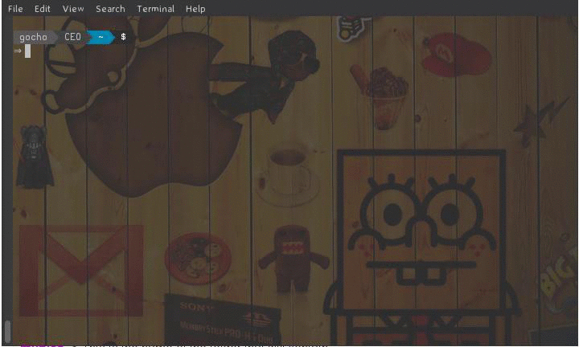

# remindme

> A small command line application that lets you store and retrieve short notes quick

[](https://travis-ci.org/GochoMugo/remindme) [](https://pypi.python.org/pypi/remindme) [](https://pypi.python.org/pypi/remindme) [](https://pypi.python.org/pypi/remindme)


If only our brains were like computers, we wouldn't have problems remembering even the small things. But sadly we aren't!




## Get Started

### Installing:

```bash
⇒  pip install remindme
```

### Upgrading:

```bash
⇒ pip install --upgrade remindme
```


## Documentation:

Usage and Help information may be found [here](https://gochomugo.github.io/remindme)


## License:

__The MIT License (MIT)__

Copyright (c) 2014-2016 Gocho Mugo <mugo@forfuture.co.ke>
