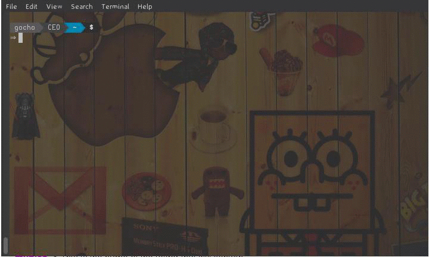

# remindme

{{ site.description }}

|version||
|python||

* [why use remindme](#why)
* [see it work](#work)
* [installation](#install)
  * [upgrading](#upgrade)

## why use remindme

Since we can not always remember everything, we sometimes need to write
some notes. Writing notes on paper is tiring, messy and not so
portable. Keeping a file(s) with several such notes may get messy real
fast.

Features:

* simple interface

    Using remindme is quite simple. Its interface is focused on being simple
    with sane default options, which are easily configured.

* multi-platform

    Remindme can run in any system with Python support. Yes, it can run on
    Windows.

* encryption support

    Uses AES cipher, in CBC mode, with 128-bit key size. See the
    [official docs](https://cryptography.io/en/latest/fernet/#using-passwords-with-fernet)
    on the encryption techniques used and detailed documentation.

click to view it better

## installation

You can install remindme using `pip`:


⇒ pip install remindme


### upgrading

You can also upgrade remindme anytime:


⇒ pip install --upgrade remindme

